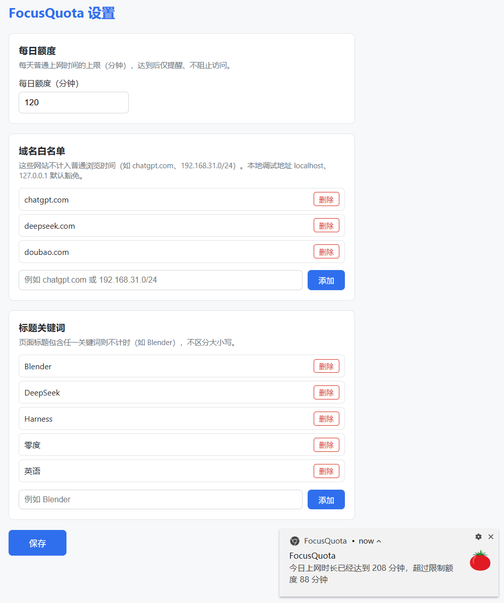

# FocusQuota

> 帮助你控制每天的**普通上网时间**——只提醒，不阻止。

FocusQuota 是一个基于 Chrome Manifest V3 的浏览时间统计与提醒扩展。
你为自己设定一个每日「普通上网时间」额度（默认 120 分钟），扩展在后台安静地计时；
用完额度后，它只会通过系统通知和图标角标提醒你，**绝不会**关闭标签页、重定向网页或阻塞访问。

工作、学习类网站可以加入白名单或用标题关键词豁免，不消耗额度。

---

## 目录

- [适用范围](#适用范围)
- [功能特性](#功能特性)
- [安装（重要）](#安装重要)
- [使用说明](#使用说明)
- [设置项详解](#设置项详解)
- [隐私说明](#隐私说明)
- [常见问题](#常见问题)
- [项目结构](#项目结构)
- [许可证与名称使用](#许可证与名称使用)

---

## 适用范围

### 适合谁用

- 想给自己的「刷网页」时间设一个每日上限，但**不希望被强制拦截**的人。
- 工作/学习和娱乐混在同一个浏览器里，需要把两类时间区分开来统计的人。
- 需要一个**完全本地、不联网、不上传任何数据**的时间统计工具的人。

### 支持的浏览器

| 浏览器 | 支持情况 |
| --- | --- |
| Google Chrome（88+，支持 MV3） | ✅ 已测试 |
| Microsoft Edge（Chromium 内核） | ✅ 同样以「加载已解压的扩展」方式安装 |
| 其他 Chromium 内核浏览器（Brave / Vivaldi 等） | ⚠️ 理论可用，未逐一测试 |
| Firefox / Safari | ❌ 不支持（扩展 API 不兼容） |

操作系统：Windows / macOS / Linux 均可，桌面版浏览器。移动端 Chrome 不支持扩展。

### 统计范围（什么会消耗额度）

只有同时满足以下**全部**条件时，时间才会被计入：

1. 当前是**活动标签页**（active tab）；
2. 该标签页所在的**窗口处于焦点**（最小化、切到别的程序、切到别的窗口都不计时）；
3. 你**人在电脑前**（约 1 分钟无键鼠输入即视为离开而暂停；正在播放声音的页面例外，看视频/听音乐不会被判定为离开）；
4. 该页面**不属于豁免页面**。

### 不消耗额度的页面（豁免）

- **特殊页面**：`chrome://`、扩展页面、`about:`、开发者工具、`file:`、`view-source:` 等一律不计时。
- **本地地址**：`localhost`、`127.0.0.1`、`::1`、`0.0.0.0` 内置豁免，本地开发调试不会被算进上网时间。
- **域名白名单**：你自己配置，支持裸域名（`chatgpt.com` 同时匹配 `www.chatgpt.com`）和 IPv4 网段（`192.168.31.0/24`）。
- **标题关键词**：页面标题包含任一关键词就豁免，不区分大小写。例如加入 `Blender` 后，在 YouTube 看 Blender 教程也不消耗额度。

### 明确不做的事

不阻止访问、不关闭标签页、不重定向、不显示拦截页、不修改网页内容、不注入任何内容脚本。
达到额度后**只提醒**。

---

## 功能特性

- **每日额度**：可配置分钟数，按**本地日期**每天零点自动重置（不是 24 小时滚动窗口）。
- **图标角标实时提示**：未达额度时显示蓝色的剩余分钟数；达到额度后变为红色，显示今日已用分钟数。
- **达额通知**：当天首次达到额度时弹一次系统通知；之后每次**在当前标签页打开新网页**时再提醒一次（带 10 秒去抖，避免重定向连弹），提醒内容形如「今日上网时长已经达到 208 分钟，超过限制额度 88 分钟」。
- **弹窗面板**：点击工具栏图标查看今日「已用 / 额度 / 剩余」，数字实时刷新。
- **防误计**：
  - 电脑睡眠或系统时间异常导致的超长区间（>30 分钟）整段丢弃；
  - 计时区间的开始时间写入本地存储，Service Worker 被浏览器回收后重启仍能正确结算；
  - 每分钟一次的兜底结算，最多损失 1 分钟。

---

## 安装（重要）

本扩展**没有上架 Chrome 应用商店**（作者未购买开发者账号），因此必须使用 Chrome 官方支持的
「**加载已解压的扩展程序**」（Load unpacked）方式安装。这是 Chrome 内置的开发者功能，不需要账号、不需要付费。

### 步骤 1：获取源码

**方式 A：git 克隆（推荐，方便后续更新）**

```bash
git clone https://github.com/Achillesy/JavaScript-FocusQuota.git
```

**方式 B：下载 ZIP**

打开 https://github.com/Achillesy/JavaScript-FocusQuota → 点击绿色的 **Code** 按钮 → **Download ZIP** → 解压。

> ⚠️ **重要**：解压后请把文件夹放在一个**长期固定、不会被清理的位置**（例如 `D:\Tools\FocusQuota`），
> 不要放在「下载」「临时文件夹」或回收站里。Chrome 只是**引用**这个文件夹的路径，
> 一旦文件夹被移动或删除，扩展就会失效。

解压/克隆后，进入的那一层文件夹里应该能直接看到 `manifest.json`，例如：

```
FocusQuota/
├── manifest.json      ← 必须在这一层
├── background.js
├── icons/
├── js/
├── options/
└── popup/
```

如果 ZIP 解压出来是 `JavaScript-FocusQuota-master/FocusQuota/...` 这种双层结构，
后面选目录时要选到**含有 `manifest.json` 的那一层**。

### 步骤 2：打开扩展管理页

在 Chrome 地址栏输入并回车：

```
chrome://extensions
```

（Edge 用户请输入 `edge://extensions`）

也可以通过菜单进入：右上角 **⋮** → **扩展程序** → **管理扩展程序**。

### 步骤 3：打开「开发者模式」

在扩展管理页的**右上角**，把 **开发者模式 / Developer mode** 开关打开。
打开后，页面左上方会新出现三个按钮：**加载已解压的扩展程序**、**打包扩展程序**、**更新**。

### 步骤 4：加载扩展

1. 点击 **加载已解压的扩展程序 / Load unpacked**；
2. 在弹出的目录选择框中，选中步骤 1 里那个**包含 `manifest.json` 的文件夹**（选文件夹本身，不要进到文件夹里选某个文件）；
3. 点击「选择文件夹」。

成功后，扩展列表里会出现 **FocusQuota**，状态为「已启用」。

### 步骤 5：把图标固定到工具栏

点击 Chrome 工具栏上的**拼图图标（扩展程序）** → 找到 FocusQuota → 点击右侧的**图钉**图标固定。
固定后才能随时看到角标上的剩余分钟数。

### 步骤 6：允许通知（首次建议检查）

达额提醒依赖系统通知。若没有看到通知，请检查：

- **Windows**：设置 → 系统 → 通知 → 确认 Google Chrome 已开启通知，并关闭「专注助手 / 请勿打扰」。
- **macOS**：系统设置 → 通知 → Google Chrome → 允许通知。

---

### 关于「开发者模式扩展」的提示条

每次启动 Chrome 时，可能会看到一条提示：「**请停用以开发者模式运行的扩展程序**」。
这是 Chrome 对所有未上架扩展的统一提醒，**点击右上角的 ✕ 关掉即可**，不影响扩展工作，
也不要点「停用」。这个提示无法从扩展内部消除——这是未购买开发者账号、不上架商店的必然代价。

### 更新到新版本

- **git 克隆的**：在项目目录执行 `git pull`，然后回到 `chrome://extensions`，点击 FocusQuota 卡片上的**刷新（↻）**按钮。
- **下载 ZIP 的**：重新下载并**覆盖到原来的同一个文件夹**（保持路径不变），然后同样点刷新按钮。

### 卸载

在 `chrome://extensions` 找到 FocusQuota → 点击「移除」。所有本地数据随扩展一并删除。

---

## 使用说明

### 查看今日用量

点击工具栏上的 FocusQuota 图标，弹窗会显示：

- 今日已用分钟数 / 每日额度；
- 剩余分钟数（额度用完后显示「今日额度已用完」）。

图标角标平时显示**剩余分钟数**（蓝底），达额后切换为**已用分钟数**（红底）。

### 打开设置

在弹窗中点击「**打开设置**」按钮，或在 `chrome://extensions` 的 FocusQuota 卡片上点击「扩展程序选项」。



设置页分三块：**每日额度**、**域名白名单**、**标题关键词**。
修改后必须点击左下角的「**保存**」——保存成功后设置页会自动关闭，新配置在下一次计时周期（最多 1 分钟内）生效。
截图右下角是达到额度后弹出的系统通知样例。

---

## 设置项详解

### 每日额度（分钟）

每天普通上网时间的上限。必须是**正整数**；填入非法值（0、负数、小数、空）保存时会自动回退为默认值 **120**。

### 域名白名单

命中的网站不消耗额度。默认包含 `chatgpt.com`、`deepseek.com`、`doubao.com`。

写法：

| 输入 | 匹配范围 |
| --- | --- |
| `chatgpt.com` | `chatgpt.com` 及其所有子域（`www.chatgpt.com`、`api.chatgpt.com`） |
| `docs.google.com` | 仅该子域及其下级子域 |
| `192.168.31.0/24` | 该 IPv4 网段内的所有地址（适合内网服务） |

注意：`notchatgpt.com` **不会**被 `chatgpt.com` 匹配（必须是完整的后缀分段匹配）。
`localhost` / `127.0.0.1` / `::1` / `0.0.0.0` 已内置豁免，无需添加。

### 标题关键词

只要当前页面**标题包含**任一关键词，该页面就不计时，**不区分大小写**。默认包含 `Blender`。

典型用法：在 YouTube 或 B 站看教程时，用课程名/软件名作关键词，
这样同一个网站上「学习的部分」豁免、「刷视频的部分」照常计时。

> 提示：关键词匹配的是页面标题，范围可能比预期宽。例如关键词设为 `英语`，
> 任何标题含「英语」的页面都会被豁免。建议使用足够具体的词。

---

## 隐私说明

- **完全本地运行**：不发送任何网络请求，没有服务器，没有统计上报，没有账号。
- **存储内容**：仅在 `chrome.storage.local` 中保存你的配置（额度、白名单、关键词）、今日累计秒数与日期、当前计时区间的开始时间戳。**不记录浏览历史，不保存你访问过的任何 URL 或页面标题。**
- **不注入内容脚本**：不读取、不修改任何网页内容。URL 与标题只在内存中用于即时的豁免判定，判定完即丢弃。
- **申请的权限及用途**：

| 权限 | 用途 |
| --- | --- |
| `storage` | 保存配置与今日用量 |
| `tabs` | 读取当前活动标签页的 URL 与标题，用于豁免判定 |
| `alarms` | 每分钟一次的兜底结算 |
| `notifications` | 达额提醒 |
| `idle` | 判断你是否离开了电脑 |

---

## 常见问题

**Q：为什么不上架 Chrome 应用商店？**
A：上架需要一次性的开发者注册费用，作者未购买。功能上「加载已解压的扩展程序」与商店安装完全等价。

**Q：每次开 Chrome 都提示「请停用以开发者模式运行的扩展程序」，能关掉吗？**
A：关不掉，这是 Chrome 的安全设计。直接点 ✕ 忽略即可，不影响使用。

**Q：为什么我明明在浏览网页，用量却没增加？**
A：请依次检查：窗口是否处于焦点、是否超过 1 分钟没有键鼠操作（且页面无声音）、
该网站是否在白名单里、页面标题是否命中了关键词。角标的数字每分钟至少刷新一次。

**Q：电脑睡眠一夜，第二天时间会被算进去吗？**
A：不会。单个计时区间超过 30 分钟会被判定为睡眠或系统时间异常，整段丢弃。

**Q：额度是几点重置的？**
A：按**本地日期**跨天时重置（即本地时间零点后的首次检查），不是从安装时刻起算的 24 小时。

**Q：能查看历史统计吗？**
A：当前版本只统计当天，不保留历史数据。

**Q：修改设置后没有立刻生效？**
A：请确认点了「保存」。配置变更后角标会立即更新，计时判定在下一个刷新周期（最多 1 分钟）生效。

---

## 项目结构

```
FocusQuota/
├── manifest.json        # MV3 清单：权限、Service Worker、popup、options
├── background.js        # Service Worker：事件监听 + 每分钟兜底结算
├── js/
│   ├── defaults.js      # 默认配置（全项目唯一默认值定义处）
│   ├── storage.js       # storage.local 读写、校验与每日重置
│   ├── timer.js         # 计时引擎：区间结算、空闲判定、防睡眠误计
│   ├── exempt.js        # 豁免规则：特殊 scheme / 域名 / CIDR / 标题关键词
│   └── notify.js        # 角标与系统通知
├── popup/               # 工具栏弹窗：今日用量
├── options/             # 设置页
├── icons/               # 16 / 48 / 128 图标
├── DESIGN.md            # 设计文档
├── IMPLEMENTATION.md    # 实现方案与决策记录
└── LICENSE              # GNU GPL v3.0 全文
```

设计取舍与实现细节见 [DESIGN.md](DESIGN.md) 与 [IMPLEMENTATION.md](IMPLEMENTATION.md)。

---

## 许可证与名称使用

### 代码许可证

本项目采用 **GNU General Public License v3.0**，完整条款见 [LICENSE](LICENSE)。

```
Copyright (C) 2026 Achilles Newman

This program is free software: you can redistribute it and/or modify
it under the terms of the GNU General Public License as published by
the Free Software Foundation, either version 3 of the License, or
(at your option) any later version.

This program is distributed in the hope that it will be useful,
but WITHOUT ANY WARRANTY; without even the implied warranty of
MERCHANTABILITY or FITNESS FOR A PARTICULAR PURPOSE.  See the
GNU General Public License for more details.

You should have received a copy of the GNU General Public License
along with this program.  If not, see <https://www.gnu.org/licenses/>.
```

要点速览（一切以 [LICENSE](LICENSE) 全文为准）：

| | |
| --- | --- |
| ✅ 允许 | 自由使用、修改、分发，包括在商业环境中使用 |
| ⚠️ 义务 | 分发修改版或衍生作品时，**必须**同样以 GPL-3.0 授权，并向接收者提供**完整源码** |
| ⚠️ 义务 | 必须保留原始的版权声明与许可证声明 |
| ❌ 禁止 | **不得**将本项目代码闭源后作为专有软件分发或销售 |

换句话说：任何人都可以 fork 本项目，但**不能把它变成一个闭源的收费扩展**。
衍生版本必须同样开源，且接收者有权免费再分发。

### 名称与图标

> **「FocusQuota」这一名称及本项目的图标不在 GPL-3.0 的授权范围内，保留所有权利。**

著作权许可证不授予商标权益（参见 GPL-3.0 第 7(e) 条）。若你基于本项目发布衍生版本：

- 必须使用**不同的名称**与不同的图标；
- 不得以任何暗示"由本项目官方发布"或"与本项目存在关联"的方式进行宣传。

在说明文档中写明"基于 FocusQuota 开发"这类**事实性描述**是允许且欢迎的。
