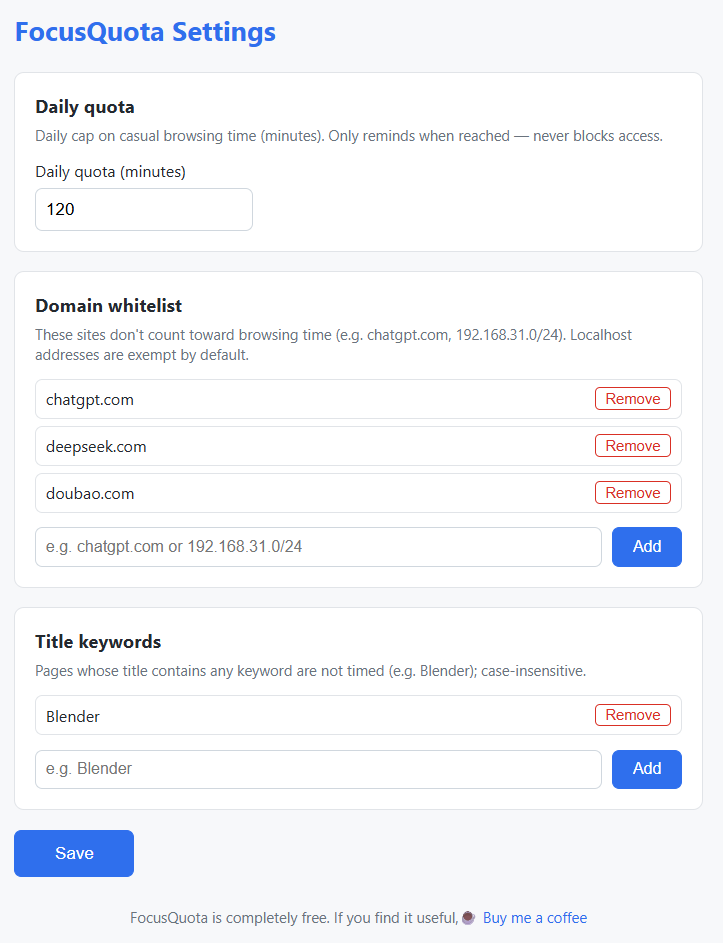

# FocusQuota

> A gentle daily quota for casual browsing — gentler than a Pomodoro timer. Reminds, never blocks.

*[中文版](README_zh.md)*

FocusQuota is a browsing-time tracker and reminder extension built on Chrome Manifest V3.
You set a daily "casual browsing" quota for yourself (default: 120 minutes), and the extension quietly tracks time in the background.
When the quota runs out, it only nudges you with a system notification and a toolbar badge — it will **never** close your tabs, redirect pages, or block access.

Work and study sites can be whitelisted or exempted by title keyword, so they don't eat into your quota.

---

## Contents

- [Who it's for](#who-its-for)
- [Features](#features)
- [Installation](#installation)
- [Usage](#usage)
- [Settings in detail](#settings-in-detail)
- [Privacy](#privacy)
- [FAQ](#faq)
- [Project structure](#project-structure)
- [Sponsor](#sponsor)
- [License & name usage](#license--name-usage)

---

## Who it's for

### Good fit

- People who want a daily cap on "doomscrolling" but **don't want to be force-blocked**.
- People whose work/study and entertainment share one browser and want the two kinds of time tracked separately.
- People who want a **fully local, offline, no-data-upload** time tracker.

### Supported browsers

| Browser | Support |
| --- | --- |
| Google Chrome (88+, MV3) | ✅ Tested |
| Microsoft Edge (Chromium) | ✅ Install via "Load unpacked" the same way |
| Other Chromium browsers (Brave / Vivaldi, …) | ⚠️ Should work in theory, not tested one by one |
| Firefox / Safari | ❌ Not supported (extension APIs differ) |

OS: Windows / macOS / Linux, desktop browsers. Mobile Chrome doesn't support extensions.

### What counts toward the quota

Time is counted only when **all** of these hold:

1. It's the **active tab**;
2. The tab's **window is focused** (minimized, switched to another app or window → not counted);
3. **You're at the computer** (~1 minute without keyboard/mouse input counts as away and pauses timing; pages playing audio are exempt — watching videos or listening to music won't mark you away);
4. The page is **not exempt**.

### What doesn't count (exemptions)

- **Special pages**: `chrome://`, extension pages, `about:`, DevTools, `file:`, `view-source:` — never counted.
- **Local addresses**: `localhost`, `127.0.0.1`, `::1`, `0.0.0.0` are built-in exemptions — local dev never eats into browsing time.
- **Domain whitelist**: your own list; supports bare domains (`chatgpt.com` also matches `www.chatgpt.com`) and IPv4 ranges (`192.168.31.0/24`).
- **Title keywords**: a page whose title contains any keyword is exempt, case-insensitive. E.g. adding `Blender` means Blender tutorials on YouTube don't consume quota either.

### What it will never do

No blocking, no tab closing, no redirects, no block pages, no page modification, no content scripts injected.
When the quota is reached, it **only reminds**.

---

## Features

- **Daily quota**: configurable minutes, auto-resets at local midnight every day (not a rolling 24-hour window).
- **Live toolbar badge**: blue remaining minutes before the quota is reached; red used-minutes after.
- **Quota notifications**: one system notification on the day's first hit; afterwards one reminder each time you **open a new page in the current tab** (10-second debounce against redirect bursts), e.g. "You've browsed for 208 minutes today, 88 minutes over your quota".
- **Popup panel**: click the toolbar icon to see today's used / quota / remaining, updated live.
- **UI language**: English UI since v1.1.0, follows the browser language automatically (Chrome's standard `_locales` mechanism); English is the default since v1.1.1, and unlisted languages fall back to English.
- **Miscount guards**:
  - over-long sessions from sleep or clock anomalies (>30 min) are discarded wholesale;
  - session start timestamps are persisted to local storage, so settlement stays correct even after the browser reclaims the Service Worker;
  - a once-per-minute safety-net settlement — at most 1 minute is ever lost.

---

## Installation

### Option 1: Chrome Web Store (recommended)

The extension is published on the Chrome Web Store — install it directly:

**[FocusQuota – Chrome Web Store](https://chromewebstore.google.com/detail/pjmaoknjkfbammiflaijahjefagjhakc)**

The store version auto-updates; nothing to do manually.

### Option 2: Load unpacked (developers)

For installing from source only. This uses Chrome's built-in developer feature — no account, no payment needed.

### Step 1: Get the source

**A: git clone (recommended, easy to update later)**

```bash
git clone https://github.com/Achillesy/JavaScript-FocusQuota.git
```

**B: Download ZIP**

Open https://github.com/Achillesy/JavaScript-FocusQuota → click the green **Code** button → **Download ZIP** → extract.

> ⚠️ **Important**: put the folder somewhere **permanent — never in Downloads, temp folders, or the trash** (e.g. `D:\Tools\FocusQuota`).
> Chrome only **references** this path; if the folder is moved or deleted, the extension breaks.

After extracting/cloning, you should see `manifest.json` right inside that folder:

```
FocusQuota/
├── manifest.json      ← must be at this level
├── background.js
├── icons/
├── js/
├── options/
└── popup/
```

If the ZIP extracts to a double-nested `JavaScript-FocusQuota-master/FocusQuota/...`,
pick the inner folder that contains `manifest.json` in the next step.

### Step 2: Open the extensions page

Type in Chrome's address bar and hit Enter:

```
chrome://extensions
```

(Edge users: `edge://extensions`.)

Or via menu: **⋮** → **Extensions** → **Manage Extensions**.

### Step 3: Enable Developer mode

Top-right corner of the extensions page: turn on **Developer mode**.
Three new buttons appear top-left: **Load unpacked**, **Pack extension**, **Update**.

### Step 4: Load the extension

1. Click **Load unpacked**;
2. Select the folder **containing `manifest.json`** from Step 1 (the folder itself, not a file inside);
3. Click "Select Folder".

**FocusQuota** now appears in the list, enabled.

### Step 5: Pin the icon to the toolbar

Click the **puzzle icon** on Chrome's toolbar → find FocusQuota → click the **pin** icon.
Only pinned can you see the remaining-minutes badge at a glance.

### Step 6: Allow notifications (recommended check)

Quota reminders need system notifications. If you never see one, check:

- **Windows**: Settings → System → Notifications → make sure Google Chrome is allowed, and turn off Focus Assist / Do Not Disturb.
- **macOS**: System Settings → Notifications → Google Chrome → Allow Notifications.

---

### About the "developer mode extensions" banner (Option 2 only)

Every Chrome launch may show: "**Disable developer mode extensions**".
This is Chrome's standard nag for all unpacked extensions — just click ✕ to dismiss; it doesn't affect the extension, and don't click "Disable". The store version has no such banner.

### Updating

- **Store version**: Chrome auto-updates; nothing to do.
- **git clone**: `git pull` in the project folder, then hit the **refresh (↻)** button on the FocusQuota card at `chrome://extensions`.
- **ZIP download**: re-download and **overwrite the same folder** (keep the path unchanged), then refresh the same way.

### Uninstall

At `chrome://extensions`, find FocusQuota → **Remove**. All local data is deleted with it.

---

## Usage

### Check today's usage

Click the FocusQuota toolbar icon. The popup shows:

- minutes used today / daily quota;
- minutes remaining ("Today's quota is used up" once exhausted).

The badge normally shows **remaining minutes** (blue); after the quota is hit it switches to **used minutes** (red).

### Open settings

Click "**Open settings**" in the popup, or "Extension options" on the FocusQuota card at `chrome://extensions`.



Three sections: **Daily quota**, **Domain whitelist**, **Title keywords**.
You must click "**Save**" — the page closes itself on success, and the new config takes effect within the next timing cycle (≤ 1 minute).
Bottom-right of the screenshot shows a sample quota-reached system notification.

---

## Settings in detail

### Daily quota (minutes)

Your daily cap on casual browsing. Must be a **positive integer**; invalid input (0, negative, decimal, empty) falls back to the default **120** on save.

### Domain whitelist

Matching sites don't consume quota. Defaults: `chatgpt.com`, `deepseek.com`, `doubao.com`.

| Input | Matches |
| --- | --- |
| `chatgpt.com` | `chatgpt.com` and all subdomains (`www.chatgpt.com`, `api.chatgpt.com`) |
| `docs.google.com` | that subdomain and its children only |
| `192.168.31.0/24` | every address in the IPv4 range (handy for intranet services) |

Note: `notchatgpt.com` is **not** matched by `chatgpt.com` (suffix match must align on dot boundaries).
`localhost` / `127.0.0.1` / `::1` / `0.0.0.0` are built-in exemptions — no need to add them.

### Title keywords

A page whose **title contains** any keyword is not timed, **case-insensitive**. Default: `Blender`.

Typical use: watching tutorials on YouTube or Bilibili — use the course/app name as the keyword,
so the "learning part" of a site is exempt while the "doomscrolling part" still counts.

> Tip: matching is on the page title and can be wider than expected. E.g. keyword `English`
> exempts every page with "English" in its title. Prefer specific words.

---

## Privacy

- **Fully local**: zero network requests. No servers, no telemetry, no accounts.
- **What's stored**: only your config (quota, whitelist, keywords), today's accumulated seconds + date, and the current session's start timestamp — in `chrome.storage.local`. **No browsing history; no URLs or page titles are ever saved.**
- **No content scripts**: page content is never read or modified. URLs/titles live in memory only for the instant exemption check, then are discarded.
- **Permissions and why**:

| Permission | Purpose |
| --- | --- |
| `storage` | save config & today's usage |
| `tabs` | read the active tab's URL & title for exemption checks |
| `alarms` | once-per-minute safety-net settlement |
| `notifications` | quota reminders |
| `idle` | detect whether you're away from the computer |

---

## FAQ

**Q: Any difference between the store version and the source version?**
A: No functional difference. The store version auto-updates.

**Q: Every Chrome launch nags "Disable developer mode extensions". Can I turn it off?**
A: No — it's Chrome's security design. Just dismiss it with ✕; it doesn't affect the extension.

**Q: I'm browsing, but the counter isn't going up. Why?**
A: Check in order: is the window focused? More than 1 minute without keyboard/mouse (and page silent)? Is the site whitelisted? Does the title hit a keyword? The badge refreshes at least once a minute.

**Q: My computer slept overnight — will that time be counted?**
A: No. Any single session over 30 minutes is treated as sleep/clock anomaly and discarded wholesale.

**Q: When does the quota reset?**
A: On the **local date** rolling over (first check after local midnight) — not 24 hours from install.

**Q: Can I see historical stats?**
A: The current version tracks today only; no history is kept.

**Q: I changed settings but nothing happened?**
A: Make sure you clicked "Save". The badge updates immediately; timing verdicts pick it up on the next refresh cycle (≤ 1 minute).

---

## Project structure

```
FocusQuota/
├── manifest.json        # MV3 manifest: permissions, Service Worker, popup, options
├── background.js        # Service Worker: event listeners + per-minute safety-net settlement
├── js/
│   ├── defaults.js      # default config (single source of defaults)
│   ├── storage.js       # storage.local I/O, validation & daily rollover
│   ├── timer.js         # timing engine: session settlement, idle detection, sleep guard
│   ├── exempt.js        # exemption rules: special schemes / domains / CIDR / title keywords
│   └── notify.js        # badge & system notifications
├── popup/               # toolbar popup: today's usage
├── options/             # settings page
├── icons/               # 16 / 48 / 128 icons
├── docs/                # design doc, implementation notes, release notes (Chinese)
└── LICENSE              # GNU GPL v3.0 full text
```

Design rationale lives in [docs/DESIGN.md](docs/DESIGN.md) and [docs/IMPLEMENTATION.md](docs/IMPLEMENTATION.md) (Chinese).

---

## Sponsor

FocusQuota is free, and always will be. If it helped you tame the scroll, buy the author a coffee:

- ☕ [Ko-fi](https://ko-fi.com/achillesy) (international, PayPal supported)
- 💸 [PayPal direct](https://paypal.me/achillesnewman)

Users in China can also scan:

| WeChat Pay | Alipay |
| --- | --- |
|  |  |

Tipping is purely voluntary and changes nothing about the features.

---

## License & name usage

### Code license

This project uses **GNU General Public License v3.0**; full text in [LICENSE](LICENSE).

```
Copyright (C) 2026 Achilles Newman

This program is free software: you can redistribute it and/or modify
it under the terms of the GNU General Public License as published by
the Free Software Foundation, either version 3 of the License, or
(at your option) any later version.

This program is distributed in the hope that it will be useful,
but WITHOUT ANY WARRANTY; without even the implied warranty of
MERCHANTABILITY or FITNESS FOR A PARTICULAR PURPOSE.  See the
GNU General Public License for more details.

You should have received a copy of the GNU General Public License
along with this program.  If not, see <https://www.gnu.org/licenses/>.
```

Key points (the [LICENSE](LICENSE) text prevails):

| | |
| --- | --- |
| ✅ Allowed | free use, modification, distribution — including commercial environments |
| ⚠️ Obligation | distributing modified/derived works **must** stay GPL-3.0 and ship **full source** |
| ⚠️ Obligation | keep the original copyright & license notices |
| ❌ Forbidden | **relicensing** this code as closed-source proprietary software |

In short: anyone may fork it, but **nobody may turn it into a closed-source paid extension**.
Derivatives must stay open, and recipients may freely redistribute.

### Name & icons

> **The name "FocusQuota" and this project's icons are NOT covered by GPL-3.0 — all rights reserved.**

A copyright license grants no trademark rights (see GPL-3.0 §7(e)). If you publish a derivative:

- use a **different name** and different icons;
- don't market it in any way implying it's official or affiliated.

Factual statements like "based on FocusQuota" in your docs are fine and welcome.

---
